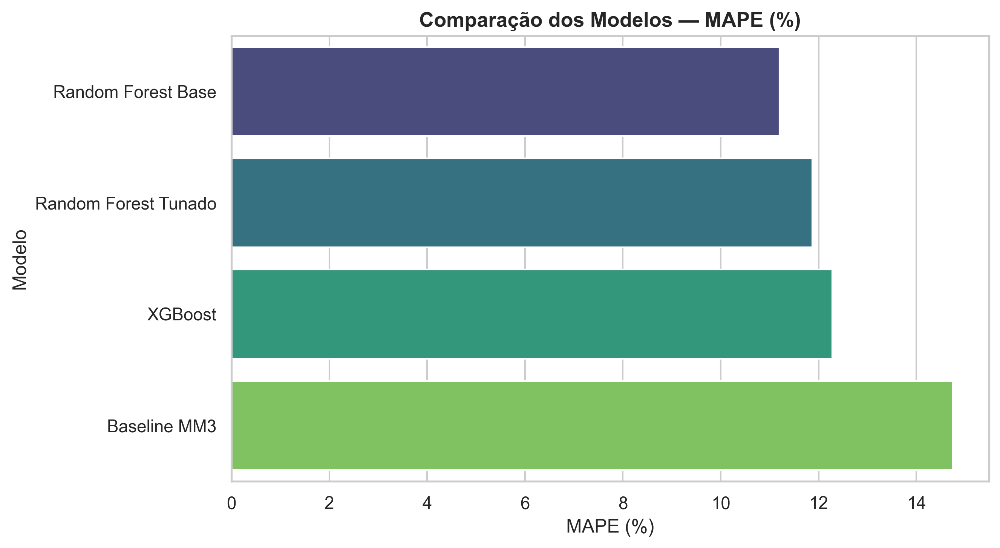
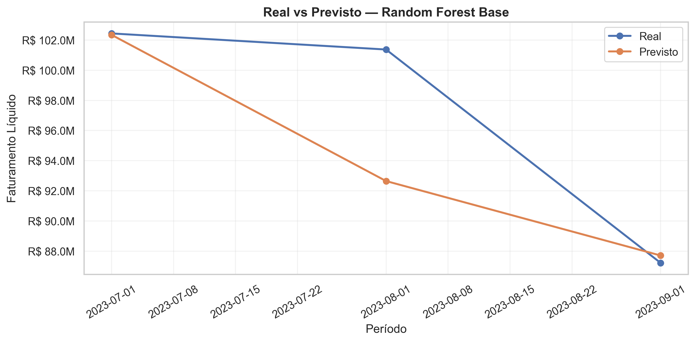
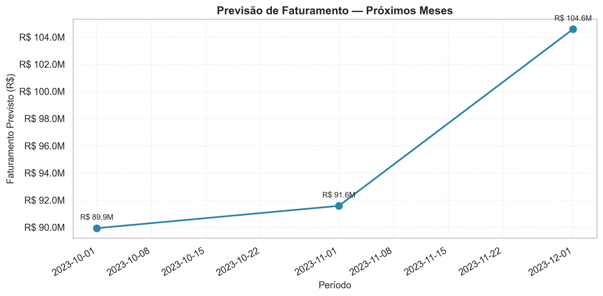

# 📈 Projeto de Previsão de Faturamento com Machine Learning

## Contexto do Projeto

Este projeto foi desenvolvido a partir de um cenário real de negócio envolvendo **previsão de faturamento no varejo**, utilizando dados históricos de vendas e técnicas de Machine Learning.

O desafio consistia em transformar grandes volumes de dados transacionais em uma solução capaz de prever o faturamento futuro, reduzindo análises manuais e permitindo maior agilidade no planejamento comercial.

A base inicial continha **milhões de registros de vendas antes do processamento**, passando posteriormente por etapas de exploração, validação, tratamento, consolidação e engenharia de atributos até ser transformada em uma série temporal adequada para modelagem preditiva.

Como solução, foi desenvolvido um pipeline completo de Ciência de Dados capaz de prever o **faturamento líquido mensal por loja**, utilizando Machine Learning para apoiar decisões relacionadas a:

- Planejamento comercial;
- Gestão de estoque;
- Campanhas promocionais;
- Definição de metas;
- Tomada de decisão orientada por dados.

O modelo final, baseado em **Random Forest Regressor**, alcançou:

- **MAPE: 11,20%**
- **WMAPE: 8,63%**

durante a validação temporal.

---

# 🎯 Objetivo do Projeto

Desenvolver uma solução preditiva capaz de estimar o faturamento futuro utilizando dados históricos de vendas, permitindo antecipar tendências e apoiar decisões estratégicas.

A solução contempla todo o ciclo de um projeto de Machine Learning:

- Exploração dos dados;
- Tratamento e validação;
- Engenharia de atributos;
- Treinamento de modelos;
- Comparação de algoritmos;
- Avaliação de métricas;
- Geração de previsões futuras;
- Disponibilização através de dashboard interativo.

---

# 📊 Funcionalidades

## Dashboard Streamlit

A aplicação permite visualizar:

- Previsão consolidada dos próximos meses;
- Previsão individual por loja;
- Histórico de faturamento;
- Comparação entre valores reais e previstos;
- Métricas dos modelos avaliados;
- Importância das variáveis utilizadas.

## Pipeline de Machine Learning

O projeto possui uma estrutura automatizada para:

- Carregamento dos dados;
- Tratamento das informações;
- Criação das variáveis temporais;
- Treinamento do modelo;
- Salvamento do modelo treinado;
- Geração das previsões.

---

#  Arquitetura da Solução

Fluxo desenvolvido:

```
Dados Transacionais
        │
        ▼
Exploração dos Dados
        │
        ▼
Tratamento e Validação
        │
        ▼
Consolidação Mensal
        │
        ▼
Engenharia de Atributos
        │
        ▼
Treinamento dos Modelos
        │
        ▼
Avaliação e Seleção
        │
        ▼
Previsões Futuras
        │
        ▼
Dashboard Streamlit
```

---

# 🔎 Análises e Insights Gerados

Durante a etapa exploratória foram identificados diversos comportamentos relevantes.

## Influência do histórico recente

As variáveis relacionadas ao faturamento dos meses anteriores apresentaram maior importância para o modelo.

Isso demonstra que o comportamento recente da receita possui forte capacidade de explicar o faturamento futuro.

## Padrões sazonais

O modelo conseguiu capturar variações temporais presentes no histórico, permitindo identificar períodos com maior ou menor tendência de faturamento.

## Diferenças entre lojas

A identificação da loja apresentou relevância no modelo, indicando que cada unidade possui características próprias de comportamento.

## Tratamento de registros negativos

Durante a análise dos dados foi identificado que registros negativos não deveriam ser avaliados apenas pelo valor bruto.

Existiam situações em que:

- O valor bruto era positivo;
- O valor bruto era zero;
- Porém o faturamento líquido final era negativo.

Por isso, a modelagem utilizou como variável objetivo o:

**Faturamento Líquido Final**

garantindo maior consistência na previsão.

---

#  Engenharia de Atributos

Foram criadas variáveis capazes de representar comportamento histórico e tendência:

- Faturamento do mês anterior (`lag_1_mes`);
- Faturamento de dois meses anteriores (`lag_2_meses`);
- Faturamento de três meses anteriores (`lag_3_meses`);
- Média móvel dos últimos meses;
- Taxa de crescimento;
- Variáveis temporais;
- Identificação da loja.

Esses atributos permitiram ao modelo aprender padrões históricos de comportamento.

---

#  Modelos Avaliados

Foram comparados diferentes algoritmos:

| Modelo | MAPE (%) |
|---|---:|
| Random Forest Base | **11,20** |
| Random Forest Tunado | 11,87 |
| XGBoost | 12,28 |
| Baseline Média Móvel | 14,75 |

---

#  Modelo Final Escolhido

O modelo selecionado foi:

## Random Forest Regressor

Desempenho obtido:

- **MAPE: 11,20%**
- **WMAPE: 8,63%**

Motivos da escolha:

- Menor erro entre os modelos avaliados;
- Boa capacidade de capturar padrões históricos;
- Maior estabilidade;
- Boa relação entre desempenho e interpretabilidade.

Comparado ao baseline de média móvel, o modelo conseguiu reduzir significativamente o erro, demonstrando capacidade de capturar padrões além de uma simples tendência histórica.

---

# 📈 Resultados e Gráficos

## 1. Comparação de Modelos (MAPE)

O gráfico apresenta o desempenho dos modelos avaliados.

O **Random Forest Base** apresentou o menor erro percentual, com **MAPE de 11,20%**.



---

## 2. Real vs Previsto – Período de Teste (jul–set/2023)

Comparação entre valores reais e previstos durante o período de validação.

O resultado demonstra boa aderência do modelo ao comportamento observado.



---

## 3. Previsão Futura – Próximos 3 Meses

Projeção consolidada para:

- Outubro/2023;
- Novembro/2023;
- Dezembro/2023.

O modelo identificou crescimento sazonal esperado no final do ano.



---

#  Previsões Futuras Geradas

| Período | Previsão |
|---|---:|
| Outubro/2023 | R$ 89,9 milhões |
| Novembro/2023 | R$ 91,6 milhões |
| Dezembro/2023 | R$ 104,6 milhões |

O crescimento observado em dezembro acompanha padrões sazonais identificados no histórico.

---

#  Benefícios Gerados pelo Projeto

Além da construção do modelo preditivo, a solução trouxe benefícios analíticos e operacionais.

## Redução de análises manuais

O pipeline automatiza o processo de geração das previsões, reduzindo esforço operacional e aumentando a reprodutibilidade.

## Antecipação de cenários

A previsão permite identificar antecipadamente possíveis períodos de crescimento ou redução de faturamento.

## Planejamento comercial

As previsões podem apoiar:

- Definição de metas;
- Planejamento de campanhas;
- Distribuição de esforços comerciais;
- Avaliação de oportunidades.

## Gestão de estoque

Uma previsão de demanda mais estruturada auxilia:

- Preparação para períodos sazonais;
- Redução do risco de ruptura;
- Melhor planejamento de compras.

## Tomada de decisão orientada por dados

O projeto transforma milhões de registros históricos em uma ferramenta capaz de gerar informações estratégicas para diferentes áreas do negócio.

---

# ⚠️ Riscos do Modelo em Produção

Apesar do desempenho apresentado, modelos preditivos precisam de acompanhamento contínuo.

## Mudança no comportamento do consumidor

Alterações de mercado, concorrência ou hábitos de compra podem modificar padrões históricos.

## Mudanças comerciais

Novas campanhas, alterações de preço ou mudanças no mix de produtos podem impactar a previsão.

## Problemas na qualidade dos dados

Dados incompletos, atrasados ou inconsistentes podem reduzir a confiabilidade das previsões.

## Perda de performance ao longo do tempo

O desempenho observado na validação pode diminuir conforme novos cenários aparecem.

---

# 🔄 Monitoramento em Produção

Uma implementação produtiva deveria realizar acompanhamento mensal.

Fluxo recomendado:

```
Faturamento Realizado
        │
        ▼
Comparação com Previsão
        │
        ▼
Cálculo do Erro
        │
        ▼
Avaliação das Métricas
        │
        ▼
Ações Corretivas
```

Indicadores acompanhados:

- MAPE mensal;
- WMAPE mensal;
- Diferença entre previsto e realizado;
- Alterações no comportamento das vendas.

---

# 🚨 Plano de Ação Caso o Erro Aumente

Caso o erro ultrapasse a meta definida:

## 1. Investigar a causa

Avaliar:

- Mudanças no mercado;
- Alterações comerciais;
- Qualidade dos dados;
- Eventos fora do padrão.

## 2. Atualizar os dados

Realizar:

- Inclusão dos novos períodos;
- Revisão das variáveis;
- Atualização da base histórica.

## 3. Reavaliar modelos

Comparar novamente:

- Random Forest;
- XGBoost;
- Novos algoritmos.

## 4. Validar antes da substituição

O novo modelo deve apresentar desempenho superior antes de entrar em produção.

---

# 🚀 Melhorias Futuras

Algumas evoluções poderiam aumentar a capacidade preditiva da solução.

## Inclusão de variáveis externas

Adicionar informações como:

- Feriados;
- Datas comemorativas;
- Campanhas promocionais;
- Eventos;
- Indicadores econômicos;
- Estoque disponível.

## Modelos específicos por loja

Avaliar:

- Modelos individuais;
- Clusterização de lojas;
- Modelos híbridos.

## Integração com sistemas corporativos

Possibilidades:

- Dashboards corporativos;
- Ferramentas de BI;
- Sistemas de planejamento comercial;
- Processos automatizados.

---

# 📁 Estrutura do Projeto

```
previsao-faturamento/

├── app/
│   └── app.py

├── data/
│   ├── raw/
│   │   └── Dados originais (não versionados)
│   │
│   ├── processed/
│   │   └── Dados processados localmente
│   │
│   └── sample/
│       ├── df_mensal.csv
│       └── previsoes_futuras.csv

├── models/
│   └── rf_model.pkl

├── notebooks/
│   ├── 01_exploracao_dados.ipynb
│   ├── 02_tratamento_dados.ipynb
│   └── 03_modelagem.ipynb

├── outputs/
│   ├── comparacao_modelos.png
│   ├── real_vs_previsto_melhor_modelo.png
│   └── previsao_futura.png

├── src/
│   ├── data_cleaning.py
│   ├── features.py
│   ├── model.py
│   ├── predict.py
│   └── utils.py

├── main.py
├── requirements.txt
└── README.md
```

---

# 🖥️ Dashboard Streamlit

Executar:

```bash
streamlit run app/app.py
```

Funcionalidades:

- Previsões futuras;
- Histórico x previsto;
- Métricas do modelo;
- Filtro por loja;
- Importância das variáveis.

---

# ▶️ Como Executar o Projeto

## Criar ambiente virtual

```bash
python -m venv .venv
```

## Ativar ambiente

Windows:

```bash
.\.venv\Scripts\activate
```

## Instalar dependências

```bash
pip install -r requirements.txt
```

## Executar pipeline

```bash
python main.py
```

## Executar dashboard

```bash
streamlit run app/app.py
```

---

# 👤 Desenvolvido por

Felipe Tamiozzo  
Felipe Barbosa  
Kilian Israel  

Projeto de Ciência de Dados aplicado à previsão de faturamento utilizando Machine Learning.

---

# 📄 Licença

Projeto desenvolvido para fins de estudo, portfólio e demonstração técnica.
````

